# Install

```sh
$ npm install react-native-alert-pickers
$ react-native link react-native-alert-pickers
```

`注意：使用global关键词可以全局使用,最好在root component创建时创建以下选择器或提示框`

## Advanced Pickers

---

## ColorPicker

* **ColorPickerConfig 相关说明**

| params        | type            |      value      | description        |
| :------------ | :-------------- | :-------------: | ------------------ |
| `useHex`      | `bool`          | default: `true` | 是否以 16 进制显示 |
| `selectTitle` | `string`        | default: `选择` | 选择按钮标题       |
| `cancelTitle` | `string`        | default: `取消` | 取消按钮标题       |
| `onSelected`  | `color => void` |       无        | 点击选择后触发     |

* **显示函数**

```js
    /**
     *
     * @param colorPickerConfig 颜色选择器配置
     */
    show(colorPickerConfig?: ColorPickerConfig);
```

* **使用栗子**

```js
import { ColorPicker } from 'react-native-alert-pickers'

<View style={{ flex: 1, alignItems: "center", justifyContent: "center" }}>
    <ColorPicker ref={r => (this.picker = r)} />
    <Text onPress={() => this.picker.show()}>点我</Text>
</View>
```

<div align = "center">
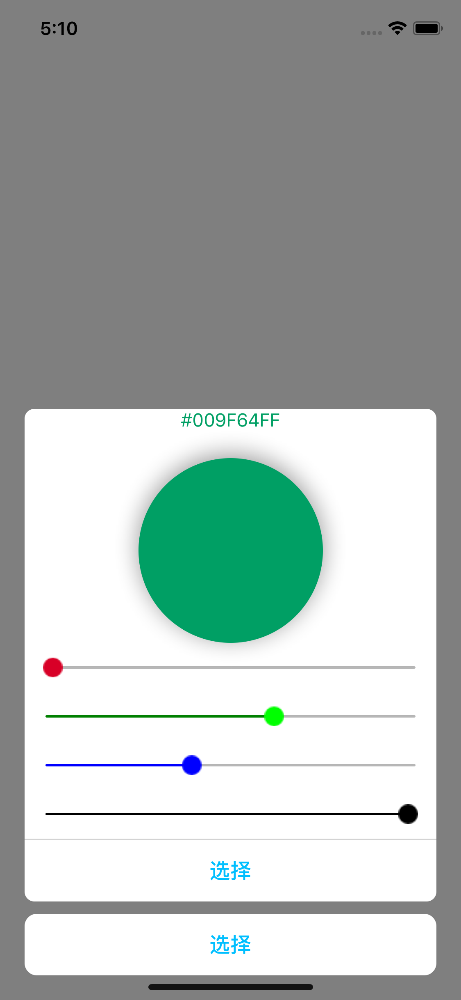
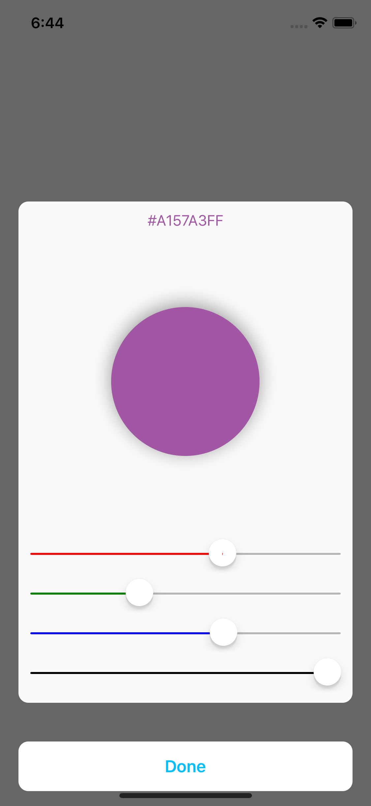
</div>

## LocalePicker/ContactPicker

iOS 使用 <u>`ContactPicker`</u> 需在 info.plist 中设置 <u>`NSContactsUsageDescription`</u>

* **LocalePickerConfig/ContactPickerConfig 相关说明(同时适用于两个选择器)**

| params              | type                     |         value          | description                  |
| :------------------ | :----------------------- | :--------------------: | ---------------------------- |
| `mode`              | `string`                 | `country`, `phoneCode` | 显示内容(LocalePicker 才有)  |
| `searchPlaceholder` | `string`                 |    default: `搜索`     | 搜索框占位符                 |
| `searchCancelTitle` | `string`                 |    default: `取消`     | 搜索框取消按钮标题           |
| `cancelTitle`       | `string`                 |    default: `取消`     | 选择器取消按钮标题           |
| `onSelected`        | `(name) => void`         |           无           | `country` 触发函数           |
| `onSelected`        | `(name, code) => void`   |           无           | `phoneCode` 触发函数         |
| `onSelected`        | `(name, number) => void` |           无           | ContactPicker 选择后触发函数 |

* **显示函数**

```js
    /**
     *
     * @param localePickerConfig 地区选择配置参数
     */
    show(localePickerConfig?: LocalePickerConfig);

    /**
     *
     * @param ContactPickerConfig 联系人配置参数
     */
    show(contactPickerConfig?: ContactPickerConfig);
```

* **使用栗子**

```js
import { PhoneCodePicker, ContactPicker } from 'react-native-alert-pickers'

<View style={{ flex: 1, alignItems: "center", justifyContent: "center" }}>
    <LocalePicker ref={r => (this.picker1 = r)} />
    <ContactPicker ref={r => (this.picker2 = r)} />
    <Text onPress={() => this.picker1.show({ mode: "phoneCode" })}>
        点我
    </Text>
</View>
```

<div align = "center">
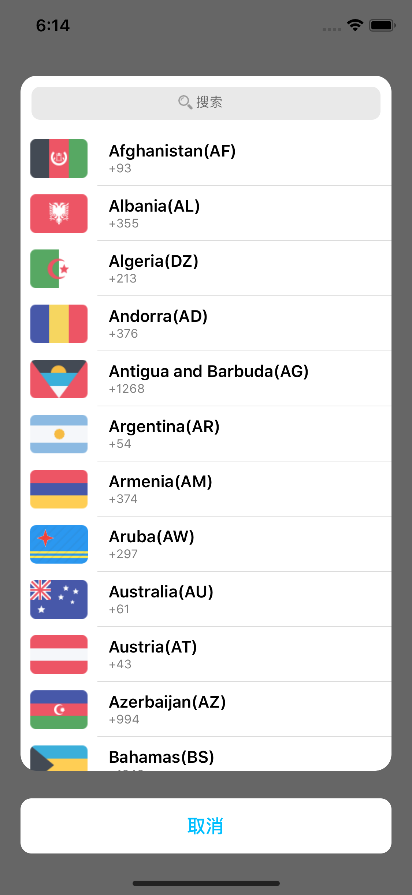
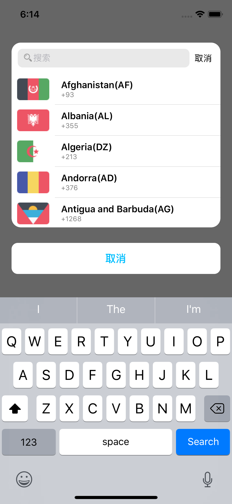
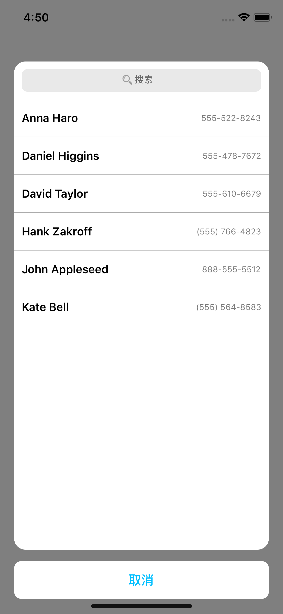

</div>

## TextFieldPicker

* **TextFieldPickerConfig 相关说明**

| params             | type             |      value      | description               |
| :----------------- | :--------------- | :-------------: | ------------------------- |
| `title`            | `string`         |       无        | 提示标题                  |
| `message`          | `string`         |       无        | 提示信息                  |
| `textFieldsOption` | `array`          |       无        | 支持大多数 TextInput 属性 |
| `submitTitle`      | `string`         | default: `确定` | 提交按钮标题              |
| `onSubmitEditing`  | `values => void` |       无        | 点击提交按钮回调          |

```
1.textFieldsOption赋值说明：textFieldsOption必须传入key键值。
	例如： textFieldsOption={[
								{ key: 'firstField', placeholder: '输入第一个TextField的值'},
								{ key: 'secondField', placeholder: '输入第二个TextField的值'}
							]}.
2.提交按钮触发返回的值说明: 返回值与textFieldsOption中的key有关。
	以上面textFieldsOption为例子，则返回的值(values)为
	{ firstField: "第一个TextField输入的值", secondField: "第二个TextField输入的值" }
```

* **显示函数**

```js
    /**
     *
     * @param textFieldPickerConfig 选择器配置
     */
    show(textFieldPickerConfig?: TextFieldPickerConfig);
```

* **使用栗子**

```js
import { TextFieldPicker } from 'react-native-alert-pickers'

<View style={{ flex: 1, alignItems: "center", justifyContent: "center" }}>
    <TextFieldPicker ref={r => (this.picker = r)} />
        <Text
          onPress={() =>
            this.picker.show({
              title: "标题",
              message: "信息",
              textFieldsOption: [
                { key: "username", placeholder: "请输入用户名" },
                { key: "password", placeholder: "请输密码" },
                { key: "cpassword", placeholder: "确认密码" }
              ],
              onSubmitEditing: values => alert(JSON.stringify(values))
            })
          }
        >
          点我
        </Text>
</View>
```

<div align = "center">
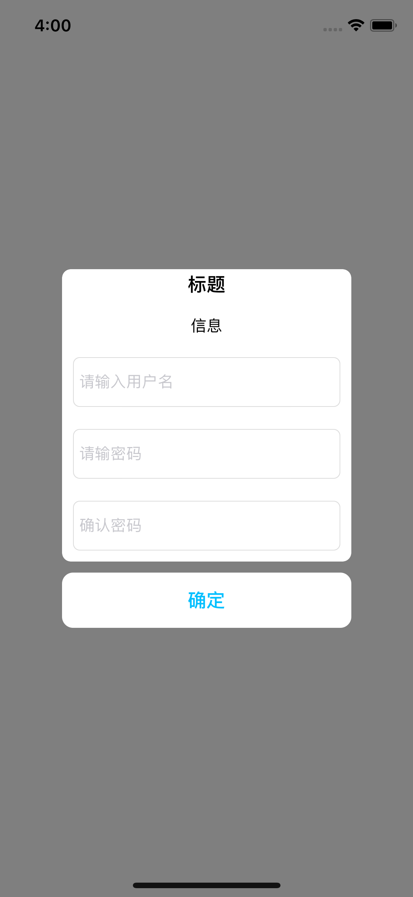
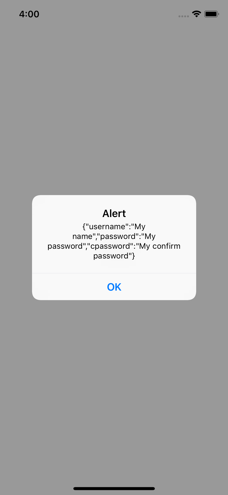
</div>

## ImagePicker

`ImagePicker 当前仅支持iOS`
iOS 使用 <u>`ImagePicker`</u> 需在 info.plist 设置 <u>`NSPhotoLibraryUsageDescription`</u>

* 附：**[图片资源](https://github.com/dillidon/alerts-and-pickers/tree/new/Example/Resources/Assets.xcassets/interior%20designs)**

- **`ImagePickerConfig`相关说明**

| params        | type             |       value       | description                                     |
| :------------ | :--------------- | :---------------: | ----------------------------------------------- |
| `horizontal`  | `bool`           |  default: `true`  | 是否水平显示                                    |
| `provider`    | `string`         | default: `system` | 图片提供者, 另外一个值为`self`                  |
| `images`      | `array`          |        无         | 当 provider="self"时，需要给该属性赋值.         |
| `selectMode`  | `string`         | default: `single` | 图片选择模式，`single`表示单选,`multiple`为多选 |
| `selectTitle` | `string`         |  default: `选择`  | 选择按钮标题                                    |
| `cancelTitle` | `string`         |  default: `取消`  | 取消按钮标题                                    |
| `onSelected`  | `indexs => void` |        无         | 选择图片后回调                                  |

```
1.关于images赋值说明：images值类型(images={[require('image/path/test.png'), { uri: 'image/url/path'}]}).
2.关于点击确定按钮回调参说明：若provider="self"则indexs代表images属性的下标集合;若provider="system"则indexs代表图片集合
```

* **显示函数**

```js
    /**
     *
     * @param imagePickerConfig 选择器配置
     */
    show(imagePickerConfig?: ImagePickerConfig);
```

* **使用栗子**

```js
import { ImagePicker } from 'react-native-alert-pickers'

<View style={{ flex: 1, alignItems: "center", justifyContent: "center" }}>
    <ImagePicker ref={r => (this.picker = r)} />
    <Text onPress={() => this.picker.show()}>点我</Text>
</View>
```

<div align = "center">

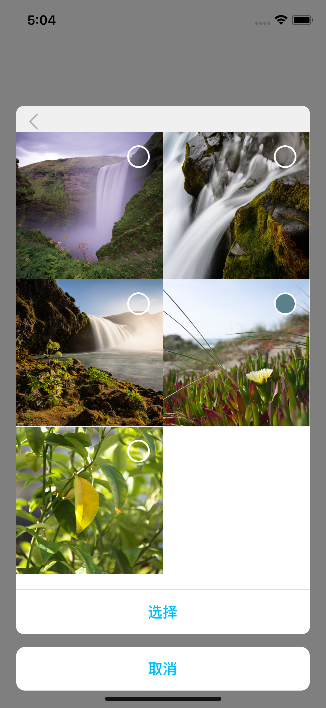
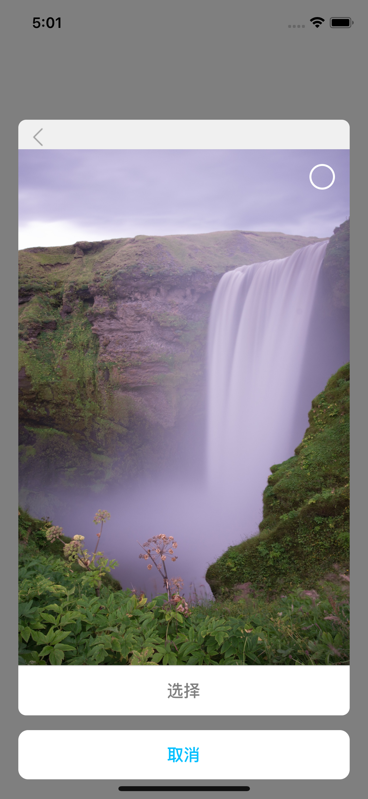
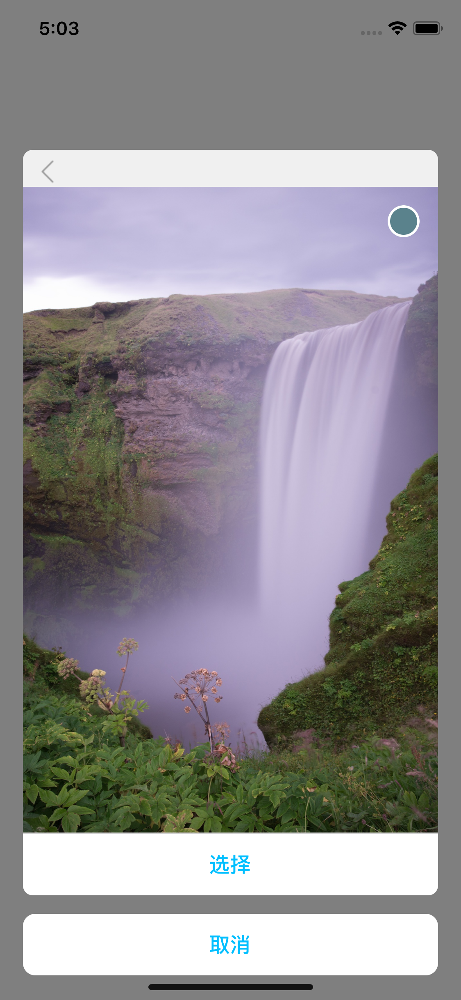
</div>

## Advanced Alert

---

## SimpleAlert

* **SimpleAlertConfig 相关说明**

| params          | type            |             value              | description      |
| :-------------- | :-------------- | :----------------------------: | ---------------- |
| `mode`          | `string`        |        default: `alert`        | 提示模式         |
| `title`         | `string`        |            optional            | 标题             |
| `message`       | `string`        |            optional            | 详情             |
| `buttonsOption` | `array`         | default: `[{ title: '取消' }]` | 按钮             |
| `cancelIndex`   | `number`        |          default: `0`          | 取消按钮所在下标 |
| `onSelected`    | `title => void` |               无               | 点击按钮回调     |

* **显示函数**

```js
    /**
     *
     * @param simpleAlertConfig 提示配置
     */
    show(simpleAlertConfig?: SimpleAlertConfig);
```

* **使用栗子**

```js
import { SimpleAlert } from 'react-native-alert-pickers'

<View style={{ flex: 1, alignItems: "center", justifyContent: "center" }}>
    <SimpleAlert ref={r => (global.alert = r)}/>
    <Text onPress={() => {
        global.alert.show({ mode: 'alert', title: '标题', message: '详情' })
        // global.alert.show({ mode: 'action', title: '标题', message: '详情' })
    }}>点我</Text>
</View>
```

<div align = "center">
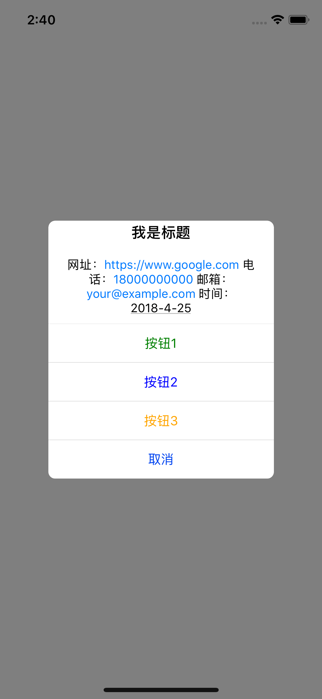
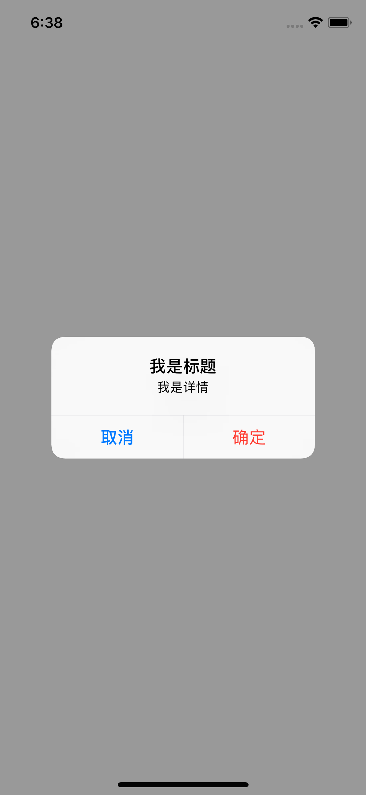
</div>

## Others

## SearchBar

* **相关属性**

| props              | type            |              value              | description             |
| :----------------- | :-------------- | :-----------------------------: | ----------------------- |
| `barWidth`         | `number/string` |        default: `'100%'`        | 搜索框宽度              |
| `tintColor`        | `string`        | default: `'rgb(220, 220, 220)'` | 搜索框背景色            |
| `backgroundColor`  | `string`        |         default `white`         | 搜索框容器视图背景色    |
| `textColor`        | `string`        |             `black`             | 字体颜色                |
| `textInputProps`   | `object`        |               无                | 支持很多 TextInput 属性 |
| `onChangeText`     | `text => void`  |               无                | 输入字串改变回调        |
| `onSubmitEditing`  | `text => void`  |               无                | 点击提交按钮回调        |
| `cancelTitle`      | `string`        |         default: `取消`         | 取消按钮标题            |
| `cancelTitleColor` | `string`        |        default: `black`         | 取消按钮颜色            |
| `onCancel`         | `() => void`    |               无                | 点击取消触发            |

* **举个栗子**

```js
import { SearchBar } from 'react-native-alert-pickers'

<View style={{ flex: 1, alignItems: "center", justifyContent: "center" }}>
    <SearchBar
        barWidth="100%"
        tintColor="white"
        backgroundColor="darkgray"
        textInputProps={{
            placeholder: "输入搜索内容",
            selectionColor: "red",
            placeholderTextColor: "blue"
        }}
        textColor="orange"
        cancelTitleColor="white"
        cancelTitle="Cancel"
    />
</View>
```

<div align = "center">

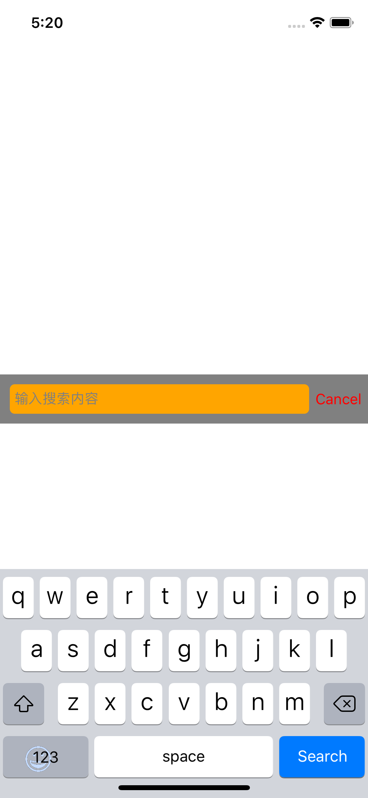
</div>
