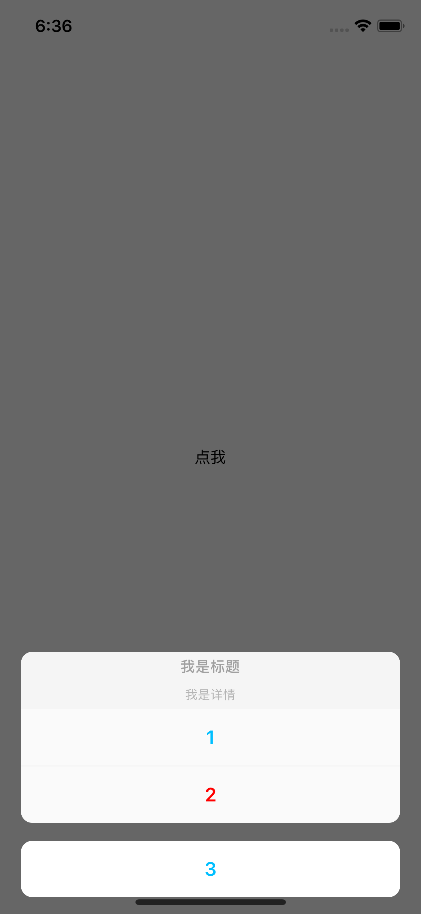
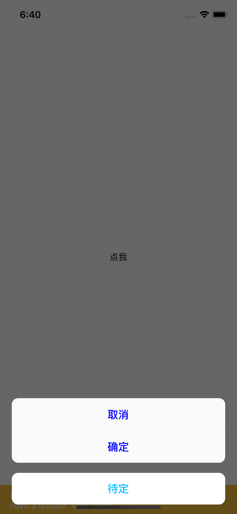
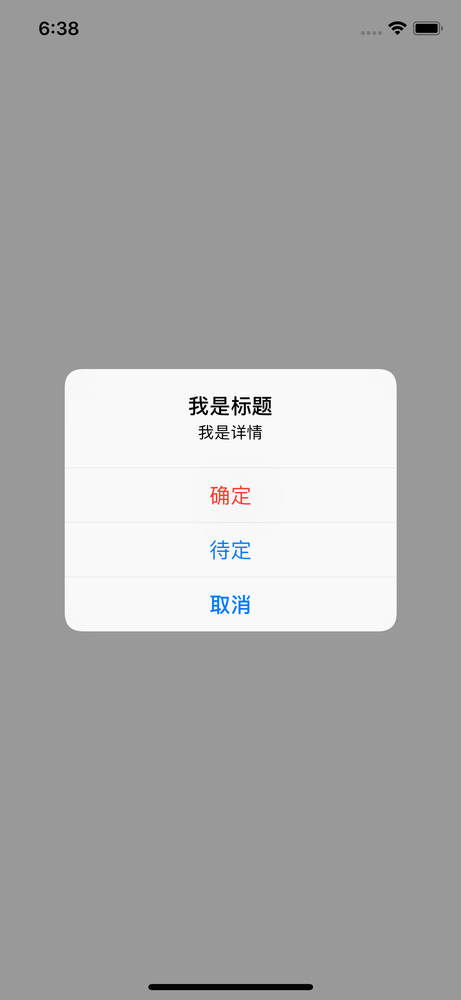

## Advanced Pickers

### Color Picker

```js
import { ColorPicker } from 'react-native-alert-pickers'

<View style={{ flex: 1, alignItems: "center", justifyContent: "center" }}>
    <ColorPicker
    	ref={r => (this.alert = r)}
    	onSelected={color => alert(color)}
    />
    <Text onPress={() => this.alert._show()}>点我</Text>
</View>
```

| 属性名      | 描述                   |  类型  |    取值    |
| :---------- | :--------------------- | :----: | :--------: |
| onSelected  | 选择颜色后回调函数     |  func  |  optional  |
| useHex      | 是否以 16 进制显示颜色 |  bool  | 默认 true  |
| selectTitle | 确定颜色按钮           | string | 默认'Done' |

<div align = "center">


</div>

---

### Phone Code Picker

```js
import { PhoneCodePicker } from 'react-native-alert-pickers'

<View style={{ flex: 1, alignItems: "center", justifyContent: "center" }}>
    <PhoneCodePicker
        ref={r => (this.picker = r)}
        onSelected={(name, code) => alert(`${name} with ${code}`)}
    />
    <Text onPress={() => this.picker.show()}>点我</Text>
</View>
```

| 属性名            | 描述           |  类型  |         取值         |
| :---------------- | :------------- | :----: | :------------------: |
| onSelected        | 选择函数触发   |  func  | (name, code) => void |
| searchPlaceholder | 搜索框占位符   | string |        '搜索'        |
| searchCancelTitle | 搜索框取消按钮 | string |        '取消'        |
| cancelTitle       | 取消按钮标题   | string |        '取消'        |

<div align = "center">


</div>

## Advanced Alert

### Simple Alert

**Action Sheet**

| 属性名      | 描述                       |   类型   |                     取值                     |
| :---------- | :------------------------- | :------: | :------------------------------------------: |
| title       | 标题                       |  string  |                   optional                   |
| message     | 信息                       |  string  |                   optional                   |
| buttons     | 按钮数组(包含取消按钮)     | [Object] | 默认[{ title:'Done', color: 'deepskyblue' }] |
| cancelIndex | 取消按钮在按钮数组中的下标 |  number  |                    默认 0                    |
| alertType   | 提示类型                   |  number  |          两种值: 'alert' or 'actionSheet'    |
| onTouched   | 点击按钮回调函数           |   func   |        函数有一个参数，点击按钮的标题        |

```js
import { SimpleAlert } from 'react-native-alert-pickers'

<View style={{ flex: 1, alignItems: "center", justifyContent: "center" }}>
    <SimpleAlert
        ref={r => (this.alert = r)}
        title="我是标题"
        message="我是详情"
        alertType="actionSheet"
        cancelIndex={2}
        buttons={[
            { title: "1", color: "deepskyblue" },
            { title: "2", color: "red" },
            { title: "3", color: "orange" }
        ]}
        onTouched={() => alert("haha")}
    />
    <Text onPress={() => this.alert._show()}>点我</Text>
</View>
```

<div align = "center">


</div>

**Alert**

| 属性名    | 描述                   |   类型   |                  取值                   |
| :-------- | :--------------------- | :------: | :-------------------------------------: |
| title     | 标题                   |  string  |                optional                 |
| message   | 信息                   |  string  |                optional                 |
| buttons   | 按钮数组(包含取消按钮) | [Object] | 默认[{ title:'Done', style: 'cancel' }] |
| onTouched | 点击按钮回调函数       |   func   |     函数有一个参数，点击按钮的标题      |

```js
import { SimpleAlert } from 'react-native-alert-pickers'

<View style={{ flex: 1, alignItems: "center", justifyContent: "center" }}>
    <SimpleAlert
        ref={r => (this.alert = r)}
        title="啊哈哈"
        message="我去"
        alertType="actionSheet"
        buttons={[
            { title: "1", style: "destructive" },
            { title: "2", style: "cancel" },
            { title: "3", style: "default" }
        ]}
        onTouched={() => alert("haha")}
    />
    <Text onPress={() => this.alert._show()}>点我</Text>
</View>
```

<div align = "center">



</div>
